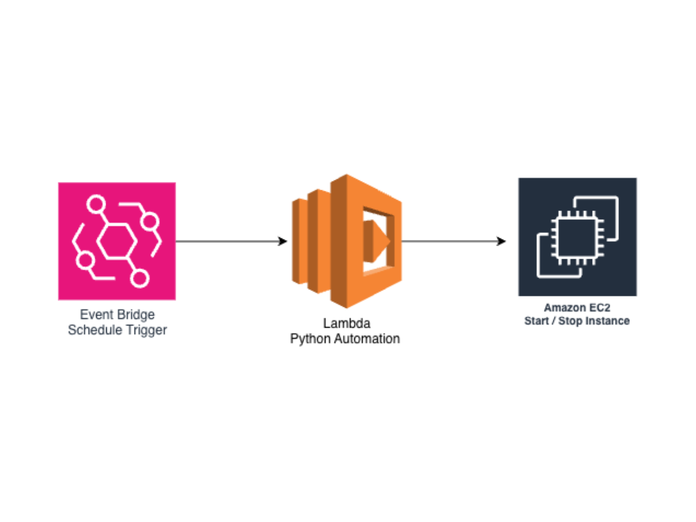

# EC2自動起動・停止

## 概要
Amazon EventBridge と Lambda を使用して、EC2インスタンスを
スケジュールに従って自動起動・停止する仕組みを構築しました。

## アーキテクチャ

## 使用サービス
- Amazon EventBridge（スケジュール管理）
- AWS Lambda（起動・停止の実行）
- Amazon EC2（対象インスタンス）
- IAM（Lambda実行ロール）

## 構成のポイント
- 平日9時に自動起動、18時に自動停止
- LambdaはPythonで実装（boto3使用）
- IAMロールで最小権限を付与

## コスト削減効果
稼働時間を約50%削減することでEC2のコストを最適化
